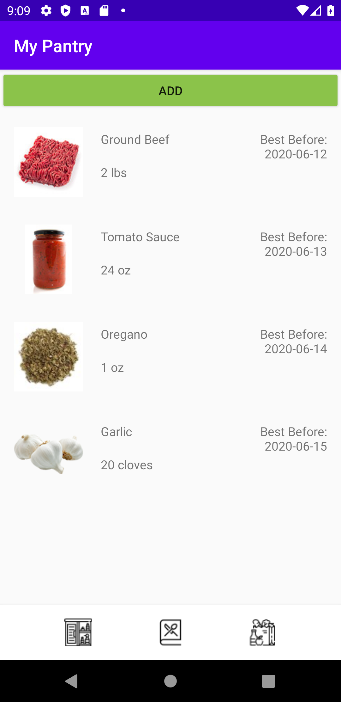
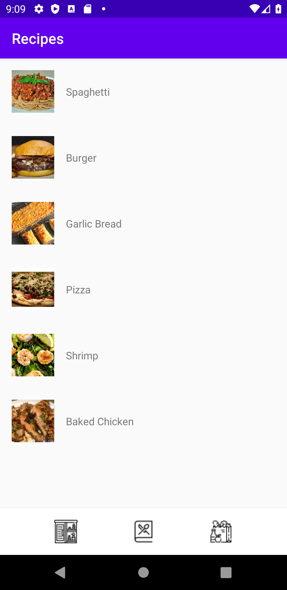
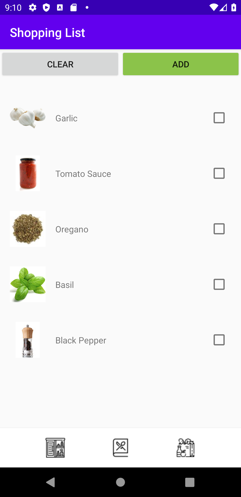

# Smart Pantry
by Thomas That, Tow Mokaramanee, Patrin Sinteppadon, Liam Albright, Nikolai Nilsen

## Description
Smart Pantry is an app that allows you to keep track of all the food you buy from the store so that you avoid wasting food. You can add food items to your pantry and the app will send a notification when some of your food is about to expire. You can also use our "Shopping List" feature to keep of what you buy at the store or look at our list of recipes to find out which meals you can make with the recipes you have.
Runs in android API level 26+. More features will be available in the future. 

## Special Instructions
If the app does not load the items in your list upon opening the app, uninstall and reinstall the app.

## Screenshots

  
   
  

